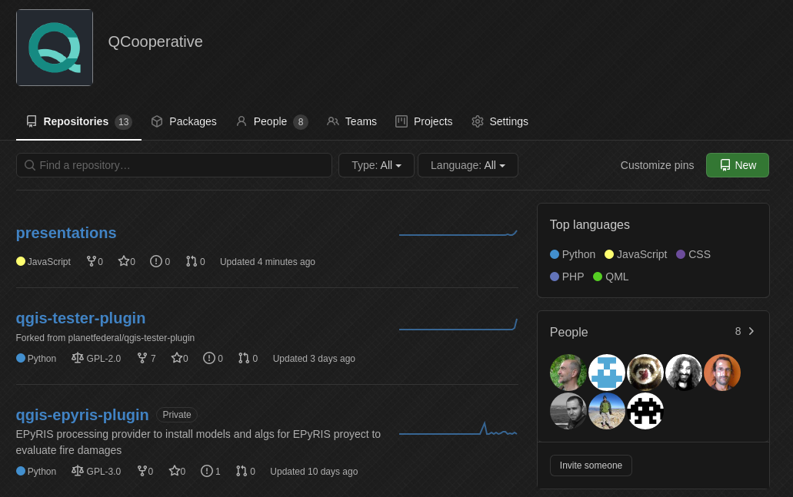
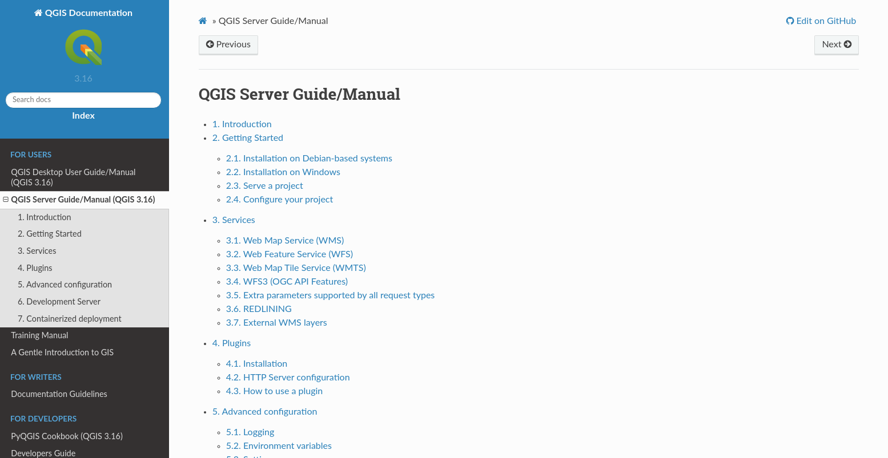
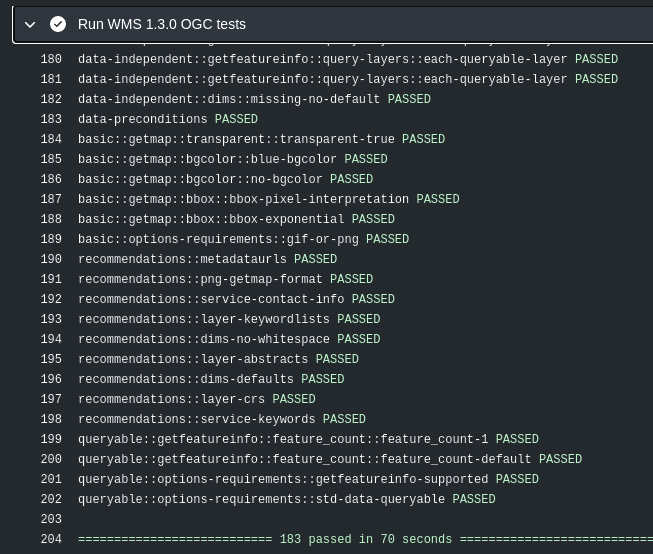
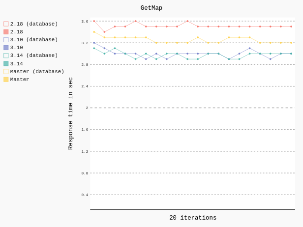
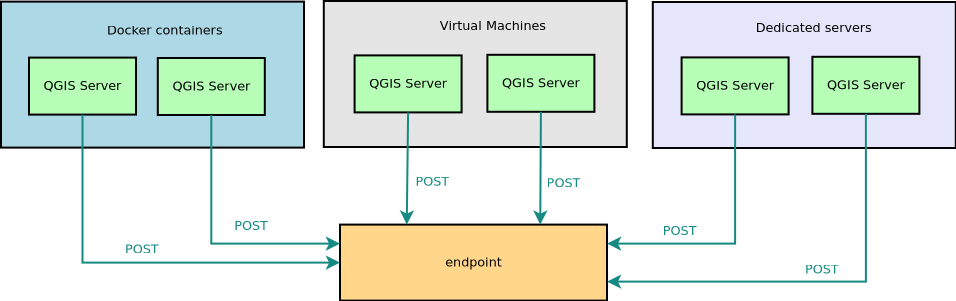
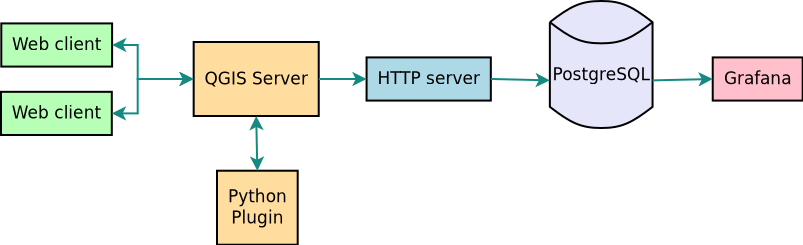
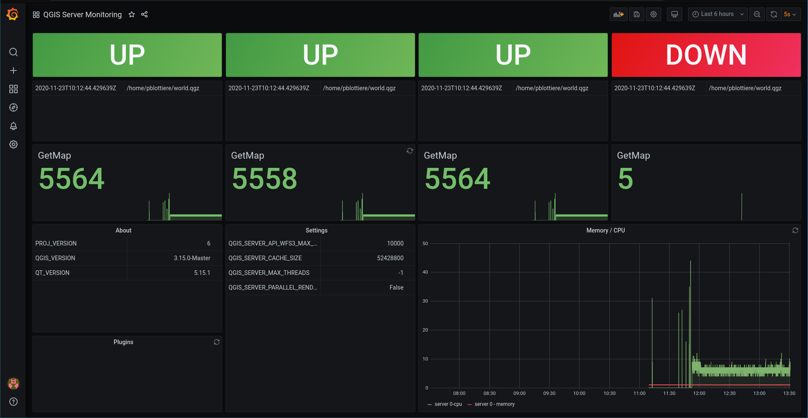

:data-transition-duration: 1500
:skip-help: true
:css: hovercraft-qcooperative-theme/css/custom-hov.css
:css: hovercraft-qcooperative-theme/css/custom.css
:css: custom.css

.. title:: QGIS Server: Présent et Futur

----

:id: presentation-title

QGIS Server: Présent et Futur
~~~~~~~~~~~~~~~~~~~~~~~~~~~~~

Paul Blottiere

QCooperative

16-12-2020

.. image:: images/qgis.png
    :class: centered
    :width: 400

----

Qui?
====

+ Paul Blottiere
    + Lead Dev à Hytech Imaging
    + Développeur QGIS core et serveur
    + Membre de la QCooperative

.. image:: images/pblottiere.png
    :class: centered
    :width: 200

.. class:: centered

   `@pblottiere <https://twitter.com/pblottiere>`_

----

QCooperative
============

+ Large panel de services SIG
+ Éthique de l'Open Source
+ Groupe International
+ Membres actifs de la communauté QGIS

.. image:: images/qcooperative.png
    :class: centered
    :width: 500

.. class:: centered

   `@CooperativeQ <https://twitter.com/CooperativeQ>`_

----

Où?
===

+ Sur le GitHub de la QCooperative

.. class:: centered

  https://github.com/qcooperative/presentations/

----

Quoi?
=====

+ QGIS Server et son écosystème
+ Travaux ~récents
+ Futur ~proche

.. image:: images/compass.jpg
    :class: centered
    :width: 500

-----

.. class:: chapter

   Travaux ~récents

-----

3.10: Dimension WMS
===================

+ René-Luc D'Hont (**3Liz**)

-----

3.10: OGC API Features (aka WFS3)
=================================

+ Alessandro Pasotti (dev) et /me (OGC) (**QCooperative**)
+ Achievements:

-----

3.14
====

+ ``GetProjetSettings`` et ``expanded`` (Marco Hugentobler de **Sourcepole**)
+ ``GetDxf`` et ``NO_MTEXT`` / ``FORCE_2D`` (Matthias Kuhn de **OPENGIS.ch**)
+ "WMS project validator" (Étienne Trimaille de **3Liz**)
+ Format ``Webp`` (Matthias Kuhn de **OPENGIS.ch**)
+ ``QGIS_SERVER_IGNORE_BAD_LAYERS`` (Alessandro Pasotti de la **QCooperative**)

-----

3.16: Amélioration du temps de lecture projet
=============================================

+ QEP **#191** par René-Luc D'Hont et David Marteau (**3Liz**)
+ Réalisations:
    + Amélioration de l'option ``trust`` et ajout de ``QGIS_SERVER_TRUST_LAYER_METADATA``
    + ``QGIS_SERVER_DISABLE_GETPRINT``

-----

3.16: Documentation
===================

+ QEP **#184** par Julien Cabieces et Benoit de Mezzo (**Oslandia**)
+ Réalisations:
    + https://docs.qgis.org/3.16/en/docs/server_manual/index.html
    + Complétude de la doc existante et nouveau contenu (déploiement, ...)

-----

3.16 Expérience utilisateur
===========================

+ QEP **#192** par Alessandro Pasotti (**QCooperative**)
+ Catalogue de projets et outil de navigation

.. image:: images/catalog.gif
    :class: centered
    :width: 800

-----

3.16: CI et certification OGC
=============================

+ QEP **#175** par /me (**QCooperative**)
+ Réalisations:
    + ``pyogctest``: Outil Python pour lancer les tests OGC WMS 1.3.0 en cli
    + Déployé dans la CI du projet QGIS pour éviter les régressions

-----

3.16: Monitoring de performances
================================

+ QEP **#185** by /me (**QCooperative**)
+ Réalisations:
    + Nouveaux scénarios
    + Détection d'anomalies
    + Mise à jour des versions

+ Résultats préliminaires: QGIS 3.X est plus rapide que QGIS 2.18 dans la plupart des cas

-----

.. class:: chapter

   Futur ~proche

.. image:: images/binoculars.jpg
    :class: centered
    :width: 400

-----

QGIS-Server-PerfSuite improvements
==================================

+ Marco Bernasocchi (`OPENGIS.ch <https://www.opengis.ch/>`_) and /me (`QCooperative <https://www.qcooperative.net/>`_)

+ A lot of new scenarios

  + GetFeatureInfo
  + Bigger images and larger project
  + Categorised and rule based renderer

+ A report with "tips and tricks" to improve performances will come in time

-----

Dimension temporelle WMS pour rasters
=====================================

+ QEP `#195 <https://github.com/qgis/QGIS-Enhancement-Proposals/issues/195>`_ by Alessandro Pasotti (`QCooperative <https://www.qcooperative.net/>`_)

+ Goal

  + Expose several individual layers as a single temporally enabled layer
  + In compliance with the "OGC Best Practice for using Web Map Services (WMS) with Time-Dependent or Elevation-Dependent Data" document
  + For GetCapabilities and GetMap requests

|

.. class:: centered

   `SERVICE=WMS&REQUEST=GetMap&LAYER=myraster&TIME= <https://localhost>`_

-----

Cache partagé
=============

+ QEP `#??? <http://localhost>`_ by Alessandro Pasotti and /me (`QCooperative <https://www.qcooperative.net/>`_)

+ Cloud environment with multiple QGIS Server instances
+ Reduce startup time by sharing information between processes
+ A long standing discussion

-----

Configuration à la volée
========================

+ QEP `#190 <https://github.com/qgis/QGIS-Enhancement-Proposals/issues/190>`_

+ How to configure QGIS Server instances on-the-fly (without restarting)?
+ Needs:

  + Reload a project
  + Deactivate/reload a plugin
  + Update the configuration
  + ...

.. class:: centered

   Avoid restarting the whole infrastructure (may be long/improve uptime)!

-----

Monitoring
==========

+ QEP `#193 <https://github.com/qgis/QGIS-Enhancement-Proposals/issues/193>`_ by /me (`QCooperative <https://www.qcooperative.net/>`_)

+ Get an insight of the state of QGIS server
+ Handling several QGIS Server instances

-----

Monitoring - POC
================

|
|

-----

Monitoring - POC
================

-----

.. class:: chapter

   Thanks

