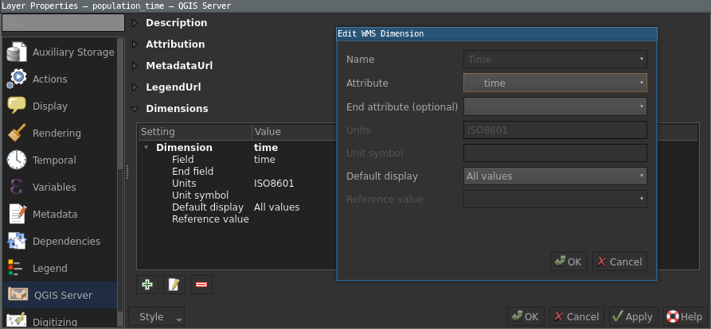
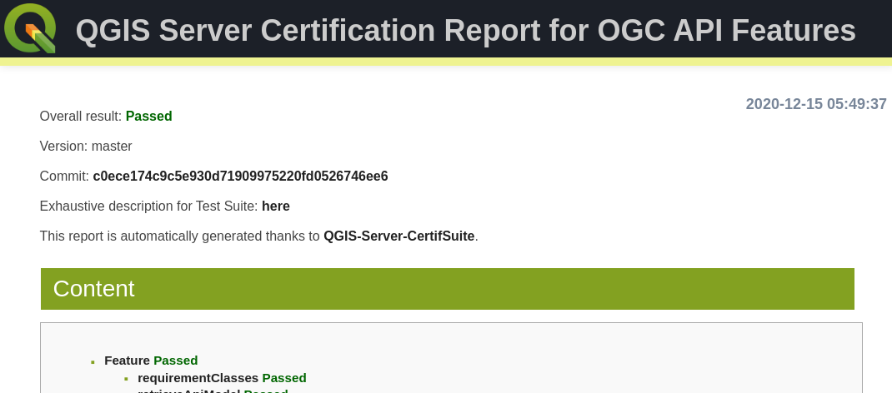

:data-transition-duration: 1500
:skip-help: true
:css: hovercraft-qcooperative-theme/css/custom-hov.css
:css: hovercraft-qcooperative-theme/css/custom.css
:css: custom.css

.. |twitter| image:: images/twitter.png
  :width: 30

.. title:: QGIS Server: Présent et Futur

----

:id: presentation-title

QGIS Server: Présent et Futur
~~~~~~~~~~~~~~~~~~~~~~~~~~~~~

Paul Blottiere

QCooperative

16-12-2020

.. image:: images/qgis.png
    :class: centered
    :width: 400

----

Qui?
====

+ Paul Blottiere
    + Lead Dev à Hytech Imaging
    + Développeur QGIS core et server
    + Membre de la QCooperative

.. image:: images/pblottiere.png
    :class: centered
    :width: 200

.. class:: centered

   |twitter| `@pblottiere <https://twitter.com/pblottiere>`_

----

QCooperative
============

+ Large panel de services SIG
+ Éthique de l'Open Source
+ Groupe International
+ Membres actifs de la communauté QGIS

.. image:: images/qcooperative.png
    :class: centered
    :width: 500

.. class:: centered

   |twitter| `@CooperativeQ <https://twitter.com/CooperativeQ>`_

----

Où?
===

+ Sur le GitHub de la QCooperative

.. image:: images/github.png
    :class: centered
    :width: 600

.. class:: centered

  https://github.com/qcooperative/presentations/

----

Quoi?
=====

+ QGIS Server et son écosystème
+ Travaux ~récents
+ Futur ~proche

.. image:: images/compass.jpg
    :class: centered
    :width: 500

-----

.. class:: chapter

   Travaux ~récents

.. image:: images/done.png
    :class: centered
    :width: 200

-----

3.10: Dimensions et WMS
=======================

+ René-Luc D'Hont (**3Liz**)
+ Couche vectorielle
+ Exemple: ``&TIME=2020``

-----

3.10: OGC API Features (aka WFS3)
=================================

+ Alessandro Pasotti (dev) et /me (OGC) (**QCooperative**)
+ JSON et OpenAPI
+ ``http://qgisserver/wfs3/collections.json?MAP=myproject.qgz``

-----

3.14
====

+ ``GetProjetSettings`` et ``expanded`` (Marco Hugentobler de **Sourcepole**)
+ ``GetDxf`` et ``NO_MTEXT`` / ``FORCE_2D`` (Matthias Kuhn de **OPENGIS.ch**)
+ "WMS project validator" (Étienne Trimaille de **3Liz**)
+ Format ``Webp`` (Matthias Kuhn de **OPENGIS.ch**)
+ ``QGIS_SERVER_IGNORE_BAD_LAYERS`` (Alessandro Pasotti de la **QCooperative**)

-----

3.16: Amélioration du temps de lecture projet
=============================================

+ QEP **#191** par René-Luc D'Hont et David Marteau (**3Liz**)
+ Réalisations:
    + Amélioration de l'option ``trust`` et ajout de ``QGIS_SERVER_TRUST_LAYER_METADATA``
    + ``QGIS_SERVER_DISABLE_GETPRINT``

.. image:: images/wip.png
    :class: centered
    :width: 200

-----

3.16: Documentation
===================

+ QEP **#184** par Julien Cabieces et Benoit de Mezzo (**Oslandia**)
+ Réalisations:
    + https://docs.qgis.org/3.16/en/docs/server_manual/index.html
    + Complétude de la doc existante et nouveau contenu (déploiement, ...)

.. image:: images/doc.png
    :class: centered
    :width: 800

-----

3.16 Expérience utilisateur
===========================

+ QEP **#192** par Alessandro Pasotti (**QCooperative**)
+ Catalogue de projets et outil de navigation

.. image:: images/catalog.gif
    :class: centered
    :width: 800

-----

3.16: CI et certification OGC
=============================

+ QEP **#175** par /me (**QCooperative**)
+ Réalisations:
    + ``pyogctest``: Outil Python pour lancer les tests OGC WMS 1.3.0 en cli
    + Déployé dans la CI du projet QGIS pour éviter les régressions

.. image:: images/ci.png
    :class: centered
    :width: 500

-----

3.16: Monitoring de performances
================================

+ QEP **#185** par /me (**QCooperative**)
+ Nouveaux scénarios
+ Détection d'anomalies
+ Mise à jour des versions

+ Résultats préliminaires: QGIS 3 est plus rapide que QGIS 2 dans la plupart des cas

.. image:: images/perf_polygons.png
    :class: centered
    :width: 600

-----

.. class:: chapter

   Futur ~proche

.. image:: images/binoculars.jpg
    :class: centered
    :width: 400

-----

QGIS-Server-PerfSuite
=====================

+ /me (**QCooperative**)
+ Encore de nouveaux scenarios:

  + Temps de chargement de gros projets
  + Moteur de rendu catégorisé et par règles
  + ``GetMap`` avec taille d'image plus importante (TODO)
  + ``GetFeatureInfo`` (TODO)
+ Et plus encore :)

+ Objectif: un rapport de trucs et astuces pour optimiser la configuration d'un projet

.. image:: images/increase2.png
    :class: centered
    :width: 150

-----

Dimension temporelle WMS pour rasters
=====================================

+ QEP **#195** par Alessandro Pasotti (**QCooperative**)

+ Exposer plusieurs couches rasters comme une seule
+ En conformité avec *OGC Best Practice for using Web Map Services (WMS) with Time-Dependent or Elevation-Dependent Data*
+ Pour les requêtes ``GetCapabilities`` et ``GetMap``

|

.. class:: centered

   `SERVICE=WMS&REQUEST=GetMap&LAYER=myraster&TIME= <https://localhost>`_

-----

Cache partagé
=============

+ QEP **#TODO** par Alessandro Pasotti and /me (**QCooperative**)

+ Environnement cloud avec plusieurs (beaucoup d') instances de QGIS Server
+ Réduire le temps de mise en service (démarrage, lecture projet et ``GetCapabilities``)
+ Une discussion de longue date

.. image:: images/penseur.jpeg
    :class: centered
    :width: 250

-----

Configuration à la volée
========================

+ QEP **#190**

+ Comment configurer des instances de QGIS Server à chaud?
+ Idées:

  + Recharger un projet
  + Désactiver/recharger un plugin
  + Mise à jour des paramètres de configuration
  + ...

|

.. class:: centered

   *Éviter de redémarrer toute une infrastructure pour un changement mineur!*

-----

Monitoring
==========

+ QEP **#193** par /me (**QCooperative**)
+ Obtenir des informations sur l'état interne de QGIS Server
+ Passage à l'échelle

.. image:: images/archi.png
    :class: centered
    :width: 1000

-----

Monitoring - POC
================

|
|

.. image:: images/poc.png
    :class: centered
    :width: 1500

-----

Monitoring - POC
================

.. image:: images/grafana.png
    :class: centered
    :width: 1000

-----

.. class:: chapter

   Merci

.. image:: images/christmas.png
    :class: centered
    :width: 600
