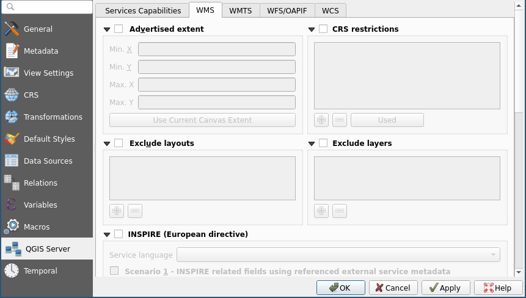

:data-transition-duration: 1500
:skip-help: true
:css: hovercraft-qcooperative-theme/css/custom-hov.css
:css: hovercraft-qcooperative-theme/css/custom.css
:css: custom.css

.. |twitter| image:: images/twitter.png
  :width: 30

.. title:: QGIS Server, le choix de la simplicité

----

:id: presentation-title

QGIS Server, le choix de la simplicité
~~~~~~~~~~~~~~~~~~~~~~~~~~~~~~~~~~~~~~

Paul Blottiere

QCooperative / Hytech-Imaging

18-01-2022

.. image:: images/qgis.png
    :class: centered
    :width: 400

----

Qui?
====

+ Paul Blottiere
    + Lead Dev à Hytech Imaging
    + Développeur QGIS core et server
    + Membre de la QCooperative

.. image:: images/pblottiere.png
    :class: centered
    :width: 200

.. class:: centered

   |twitter| `@pblottiere <https://twitter.com/pblottiere>`_

----

QCooperative
============

+ Large panel de services SIG
+ Éthique de l'Open Source
+ Groupe International
+ Membres actifs de la communauté QGIS

.. image:: images/qcooperative.png
    :class: centered
    :width: 500

.. class:: centered

   |twitter| `@CooperativeQ <https://twitter.com/CooperativeQ>`_

----

Hytech-Imaging
==============

+ TODO

.. image:: images/hti.jpg
    :class: centered
    :width: 400

.. class:: centered

   |twitter| `@HytechImaging <https://twitter.com/HytechImaging>`_

----

Quoi?
=====

+ Serveur de cartographie: c'est pas si compliqué
+ QGIS Server: simple ou pas simple?
+ Stack de déploiement: exemple

.. image:: images/compass.jpg
    :class: centered
    :width: 500

-----

Serveur de cartographie
=======================

:data-transition-duration: 0

.. image:: images/mapserver.png
    :class: centered
    :width: 1000

-----

:data-transition-duration: 0

Serveur de cartographie
=======================

.. image:: images/mapserver_distrib.png
    :class: centered
    :width: 1000

-----

:data-transition-duration: 0

Serveur de cartographie
=======================

.. image:: images/mapserver_update.png
    :class: centered
    :width: 1000

-----

:data-transition-duration: 0

Serveur de cartographie
=======================

.. image:: images/mapserver_interop.png
    :class: centered
    :width: 1000

-----

:data-transition-duration: 0

Serveur de cartographie
=======================

.. image:: images/mapserver_full.png
    :class: centered
    :width: 1000

-----

Serveur de cartographie
=======================

+ Standards OGC (Open Geospatial Consortium)

  + WMS / WMTS: retourne une image (PNG, JPG, ...)
  + WFS / OGC API Features: retourne du texte (GeoJSON, GML, ...)

.. image:: images/wms_wfs.png
    :class: centered
    :width: 1000

-----

QGIS Server
===========

+ Un serveur de cartographie

  + qui respecte les standards OGC (certifié WMS)
  + basé sur le moteur de rendu de QGIS Desktop

-----

QGIS Server
===========

+ Ses camarades open-source

.. image:: images/mapservers.png
    :class: centered
    :width: 1200

+ QGIS Server est-il *"mieux"*?

  + Non!

+ QGIS Server est-il *"plus simple"*?

  + Oui sur certains apsects

-----

QGIS Server
===========

+ WYSIWYG (What You See Is What You Get)

-----

QGIS Server
===========

+ Capacité à personaliser les rendus

  + Plugins Python (PyQGIS)
  + https://plugins.qgis.org/plugins/server/
  + https://docs.qgis.org/3.16/fr/docs/pyqgis_developer_cookbook/server.html

TODO

-----

QGIS Server
===========

+ Extensions aux services et paramètres standards OGC
+ Exemple: ``GetPrint``

  + Génération de rapport (PDF, JPG, ...)
  + Basé sur le layout manager de QGIS Desktop (encore du WYSIWYG)

-----

QGIS Server
===========

+ De nombreuses solutions clientes sur étagère

  + Lizmap
  + QWC2
  + G3W-Suite

TODO

