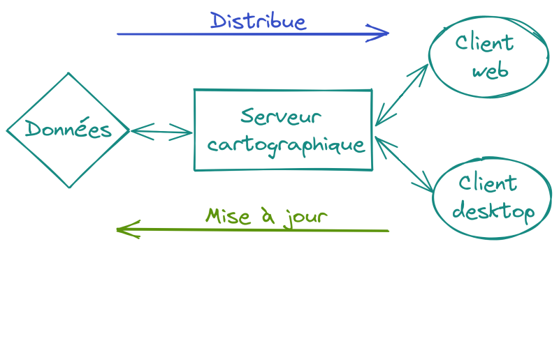

:data-transition-duration: 1500
:skip-help: true
:css: hovercraft-qcooperative-theme/css/custom-hov.css
:css: hovercraft-qcooperative-theme/css/custom.css
:css: custom.css

.. title:: QGIS Server, le choix de la simplicité

----

:id: presentation-title

QGIS Server, le choix de la simplicité
~~~~~~~~~~~~~~~~~~~~~~~~~~~~~~~~~~~~~~

Paul Blottiere

QCooperative / Hytech-Imaging

18-01-2022

.. image:: images/qgis.png
    :class: centered
    :width: 400

----

Qui?
====

+ Paul Blottiere
    + Lead Dev à Hytech Imaging
    + Développeur QGIS core et server
    + Membre de la QCooperative

.. image:: images/pblottiere.png
    :class: centered
    :width: 200

.. class:: centered

   |twitter| `@pblottiere <https://twitter.com/pblottiere>`_

----

QCooperative
============

+ Large panel de services SIG
+ Éthique de l'Open Source
+ Groupe International
+ Membres actifs de la communauté QGIS

.. image:: images/qcooperative.png
    :class: centered
    :width: 500

.. class:: centered

   |twitter| `@CooperativeQ <https://twitter.com/CooperativeQ>`_

----

Hytech-Imaging
==============

+ TODO

.. image:: images/hti.jpg
    :class: centered
    :width: 400

.. class:: centered

   |twitter| `@HytechImaging <https://twitter.com/HytechImaging>`_

----

Quoi?
=====

+ Serveur de cartographie: c'est pas si compliqué
+ QGIS Server: simple ou pas simple?
+ Stack de déploiement: ???

.. image:: images/compass.jpg
    :class: centered
    :width: 500

-----

Serveur de cartographie: c'est pas si compliqué
===============================================

:data-transition-duration: 0

.. image:: images/mapserver.png
    :class: centered
    :width: 1000

-----

:data-transition-duration: 0

Serveur de cartographie: c'est pas si compliqué
===============================================

.. image:: images/mapserver_distrib.png
    :class: centered
    :width: 1000

-----

:data-transition-duration: 0

Serveur de cartographie: c'est pas si compliqué
===============================================

-----

:data-transition-duration: 0

Serveur de cartographie: c'est pas si compliqué
===============================================

-----

:data-transition-duration: 0

Serveur de cartographie: c'est pas si compliqué
===============================================

.. image:: images/mapserver_full.png
    :class: centered
    :width: 1000

-----

Serveur de cartographie: c'est pas si compliqué
===============================================

+ Standards OGC (Open Geospatial Consortium)

  + WMS / WMTS: retourne une image (PNG, JPG, ...)
  + WFS / OGC API Features: retourne du texte (GeoJSON, GML, ...)

.. image:: images/wms_wfs.png
    :class: centered
    :width: 1000

-----

QGIS Server: simple ou pas simple?
==================================

+ Un serveur de cartographie

  + qui respecte les standards OGC (certifié WMS)
  + basé sur le moteur de rendu de QGIS Desktop

-----

QGIS Server: simple ou pas simple?
==================================

+ Ses camarades open-source

+ QGIS Server est-il *"mieux"*?

  + Non!

+ QGIS Server est-il *"plus simple"*?

  + Oui sur certains apsects

-----

QGIS Server: simple ou pas simple?
==================================

+ WYSIWYG (What You See Is What You Get)
+ Le projet .qgs/.qgz est LE fichier de configuration

.. image:: images/config.png
    :class: centered
    :width: 1200

-----

QGIS Server: simple ou pas simple?
==================================

+ Capacité à personaliser les rendus

  + Plugins Python (PyQGIS)
  + https://plugins.qgis.org/plugins/server/
  + https://docs.qgis.org/3.16/fr/docs/pyqgis_developer_cookbook/server.html

TODO

-----

QGIS Server: simple ou pas simple?
==================================

+ Extensions aux services et paramètres standards OGC
+ Exemple: ``GetPrint``

  + Génération de rapport (PDF, JPG, ...)
  + Basé sur le layout manager de QGIS Desktop (encore du WYSIWYG)

-----

QGIS Server: simple ou pas simple?
==================================

+ De nombreuses solutions clientes sur étagère

  + Lizmap
  + QWC2
  + G3W-Suite

TODO

-----

Déploiement: une stack simple
=============================

+ Conteneurisation

  + Solution simple de déploiement
  + De nombreuses images Docker disponibles pour QGIS Server
  + https://hub.docker.com/r/openquake/qgis-server
  + ``docker run -p 8010:80 openquake/qgis-server:ltr``

+ Orchestration

  + Applications multi-conteneurs / multi-hôtes (cluster)
  + Maintenance, passage à l'échelle (scaling), ...
  + Swarm, Kubernetes, ...
  + Pour des besoins simples: ``docker-compose``

-----

Déploiement: une stack simple
=============================

+ Équilibrage de charge

  + Beaucoup de clients -> plusieurs serveurs (scaling)
  + Comment distribuer les requêtes aux serveurs innocupés? -> Load-Balancer
  + NGINX (Docker image)

-----

Déploiement: une stack simple
=============================

+ Cache?

  + Ne pas activer le moteur de rendu plusieurs pour la même chose
  + WMS: retourne une image sauvée sur le disque
  + Map-Proxy (Docker image)

.. image:: images/mapproxy.png
    :class: centered
    :width: 1000

-----

Déploiement: une stack simple
=============================

+ Pour résumer

  + Composition de conteneurs Dockers avec ``docker-compose``
  + Client -> ``MapProxy`` (cache) -> ``NGINX`` (load-balancer) -> N ``QGIS Server`` (scaling)
  + https://github.com/pblottiere/qgis-server-stack (avec ``mviewer`` en client web)

|

.. class:: centered

  ``$ docker-compose up --scale qgisserver=2 -d``

-----

Déploiement: une stack simple
=============================

+ Scaling: ``qgis-server-stack-qgisserver-1`` et ``qgis-server-stack-qgisserver-2``
+ Cache: ``mapproxy/cache_data/countries_cache_EPSG3857``

.. image:: images/mviewer.png
    :class: centered
    :width: 1000
