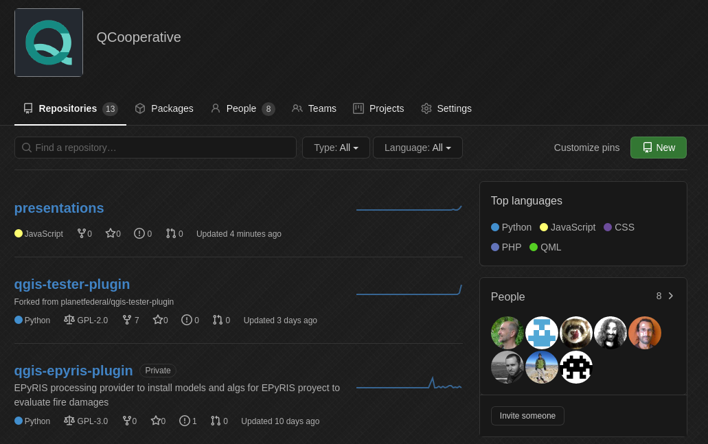
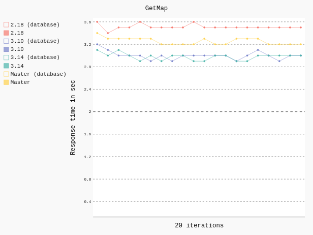

:data-transition-duration: 1500
:skip-help: true
:css: hovercraft-qcooperative-theme/css/custom-hov.css
:css: hovercraft-qcooperative-theme/css/custom.css
:css: custom.css

.. title:: QGIS Server Enhancement Proposals: achievements and perspectives

----

:id: presentation-title

QGIS Server Enhancement Proposals: achievements and perspectives
~~~~~~~~~~~~~~~~~~~~~~~~~~~~~~~~~~~~~~~~~~~~~~~~~~~~~~~~~~~~~~~~

Paul Blottiere

QCooperative

24-11-2020

.. image:: images/qgis.png
    :class: centered
    :width: 400

----

Where?
======

+ On the QCooperative GitHub

.. class:: centered

  https://github.com/qcooperative/presentations/

----

Who?
====

+ Paul Blottiere
    + Lead Software Engineer
    + QGIS server and core developer
    + QCooperative member

.. image:: images/pblottiere.png
    :class: centered
    :width: 200

.. class:: centered

   `@pblottiere <https://twitter.com/pblottiere>`_

----

QCooperative
============

+ Broad range of GIS services
+ Open Source ethics
+ International
+ Active members of the QGIS community

.. image:: images/qcooperative.png
    :class: centered
    :width: 500

.. class:: centered

   `@CooperativeQ <https://twitter.com/CooperativeQ>`_

-----

QS(erver)EPs
============

+ Recent work
+ (foreseeable) futur

-----

.. class:: chapter

   Recent work

.. image:: images/done.png
    :class: centered
    :width: 200

-----

Improve QGIS project loading time
=================================

+ QEP `#191 <https://github.com/qgis/QGIS-Enhancement-Proposals/issues/191>`_ by René-Luc D'Hont and David Marteau (`3Liz <https://www.3liz.com/>`_)
+ Achievements:
    + Improve the trust mechanism
    + New environment variable to disable layouts

.. image:: images/wip.png
    :class: centered
    :width: 200

-----

Documentation
=============

+ QEP `#184 <https://github.com/qgis/QGIS-Enhancement-Proposals/issues/184>`_ by Julien Cabieces and Benoit de Mezzo (`Oslandia <https://oslandia.com/>`_)
+ Achievements:
    + https://docs.qgis.org/3.16/en/docs/server_manual/index.html
    + Improve completeness and add new contents (deployment, ...)

.. image:: images/doc.png
    :class: centered
    :width: 800

-----

End user experience
===================

+ QEP `#192 <https://github.com/qgis/QGIS-Enhancement-Proposals/issues/192>`_ by Alessandro Pasotti (`QCooperative <https://www.qcooperative.net/>`_)
+ Simple project catalog and webgis browser out-of the box

.. image:: images/catalog.gif
    :class: centered
    :width: 800

-----

Continuous integration and OGC certification
============================================

+ QEP `#175 <https://github.com/qgis/QGIS-Enhancement-Proposals/issues/175>`_ by /me (`QCooperative <https://www.qcooperative.net/>`_)
+ Achievements:
    + `pyogctest <https://github.com/pblottiere/pyogctest>`_: Python tool to run OGC tests for WMS 1.3.0 in command line
    + Integrated in QGIS continuous integration mechanism to avoid regressions

.. image:: images/ci.png
    :class: centered
    :width: 500

-----

QGIS Server and performance monitoring
======================================

+ QEP `#185 <https://github.com/qgis/QGIS-Enhancement-Proposals/issues/185>`_ by /me (`QCooperative <https://www.qcooperative.net/>`_)
+ Achievements:
    + New scenarios
    + Anomalies detection
    + Up-to-date releases

+ Preliminary results: QGIS 3.X is faster than QGIS 2.18 in most cases!

-----

.. class:: chapter

   (foreseeable) futur

-----

QGIS-Server-PerfSuite improvements
==================================

+ Marco Bernasocchi (`OPENGIS.ch <https://www.opengis.ch/>`_) and /me (`QCooperative <https://www.qcooperative.net/>`_)

+ A lot of new scenarios

  + GetFeatureInfo
  + Bigger images and larger project
  + Categorised and rule based renderer

+ A report with "tips and tricks" to improve performances will come in time

.. image:: images/increase2.png
    :class: centered
    :width: 150

-----

WMS with Time dimension
=======================

+ QEP `#195 <https://github.com/qgis/QGIS-Enhancement-Proposals/issues/195>`_ by Alessandro Pasotti (`QCooperative <https://www.qcooperative.net/>`_)

+ Goal

  + Expose several individual layers as a single temporally enabled layer
  + In compliance with the "OGC Best Practice for using Web Map Services (WMS) with Time-Dependent or Elevation-Dependent Data" document
  + For GetCapabilities and GetMap requests

|

.. class:: centered

   `SERVICE=WMS&REQUEST=GetMap&TIME= <https://localhost>`_

-----

Shared cache
============

+ QEP `#??? <http://localhost>`_ by Alessandro Pasotti and /me (`QCooperative <https://www.qcooperative.net/>`_)

+ Cloud environment with multiple QGIS Server instances
+ Reduce startup time by sharing information between processes
+ A long standing discussion

-----

On the fly configuration
========================

+ QEP `#190 <https://github.com/qgis/QGIS-Enhancement-Proposals/issues/190>`_ by /me (`QCooperative <https://www.qcooperative.net/>`_)

+ How to configure QGIS Server instances on-the-fly (without restarting)?
+ Needs:

  + Reload a project
  + Deactivate/reload a plugin
  + Update the configuration
  + ...

.. class:: centered

   Avoid restarting the whole infrastructure (may be long/improve uptime)!

-----

Monitoring
==========

+ QEP `#193 <https://github.com/qgis/QGIS-Enhancement-Proposals/issues/193>`_ by /me (`QCooperative <https://www.qcooperative.net/>`_)

TODO

-----

.. class:: chapter

   Thanks

