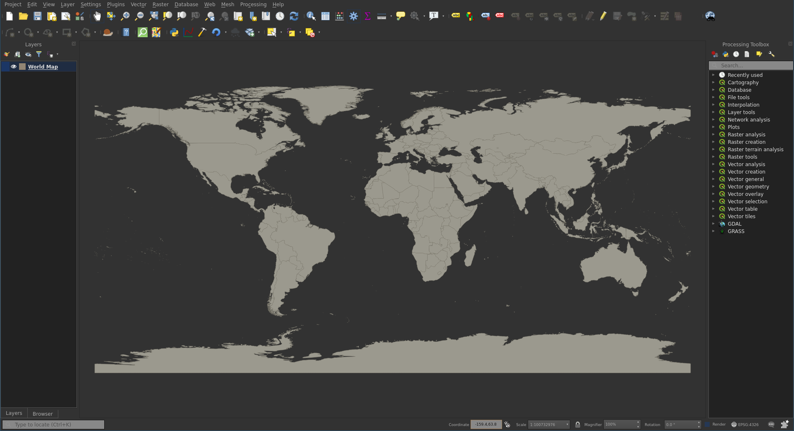
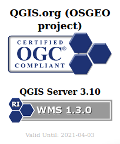
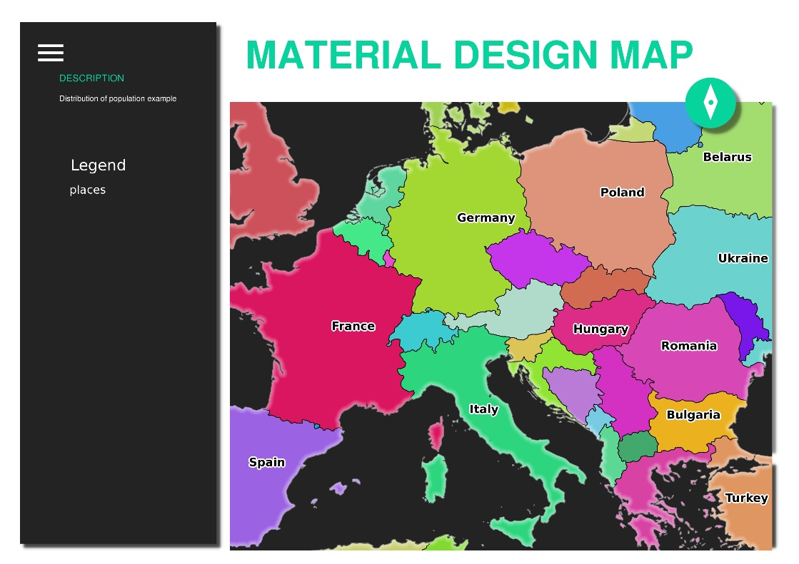

:data-transition-duration: 1500
:skip-help: true
:css: hovercraft-qcooperative-theme/css/custom-hov.css
:css: hovercraft-qcooperative-theme/css/custom.css

.. title:: Yes QGIS Server rocks!... But why?

----

:id: presentation-title

Yes QGIS Server rocks!... But why?
~~~~~~~~~~~~~~~~~~~~~~~~~~~~~~~~~~

Paul Blottiere and Alessandro Pasotti

31-07-2020

.. image:: images/qgis.png
    :class: centered
    :width: 400

----

Who?
====

+ Paul Blottiere
    + Lead Software Engineer
    + QGIS developer
    + QCooperative member

.. image:: images/pblottiere.png
    :class: centered
    :width: 200

.. class:: center

   **@pblottiere**

----

Who?
====

+ Alessandro Passoti
    + itOpen
    + QGIS developer and vice chair of QGIS.org PSC
    + QCooperative member

.. class:: center

   **@elpaso66**

-----

QCooperative
============

+ Broad range of services
+ Open Source ethics
+ International
+ Active members of the QGIS community

.. image:: images/qcooperative.png
    :class: centered
    :width: 500

.. class:: center

  **@CooperativeQ**

-----

QGIS Desktop
============

+ Main canvas as we know it
+ Layout manager
+ Processing framework
+ Database manager
+ ...

-----

QGIS Server?
============

+ Map server based on QGIS core library
+ Same release cycle with a **qgis-server** package
+ Numerous services:
    + WMS 1.1.0 and WMS 1.3.0
    + WFS 1.1 and OGC API Features (aka WFS3)
    + WMTS
    + WCS

-----

OGC certification
=================

+ QGIS 3.10 is certified for WMS 1.3.0
+ Ongoing certification for OGC API Features

-----

Configuration
=============

+ QGIS Desktop acts like a WYSIWYG

.. image:: images/config.png
    :class: centered
    :width: 800

.. class:: center

  **http://localhost/qgisserver?MAP=myproject.qgz**

-----

Vendor parameters and requests
==============================

+ Extensions of OGC standards
+ Take full advantage of QGIS specificities
+ The most famous: **GetPrint**

-----

Programmability
===============

TODO

-----

Web client
==========

TODO

-----

Robustness
==========

TODO

-----

Documentation
=============

TODO

-----

Drawbacks
=========

+ Performances

-----

Is it alive?
============

TODO
