:data-transition-duration: 1500
:skip-help: true
:css: hovercraft-qcooperative-theme/css/custom-hov.css
:css: hovercraft-qcooperative-theme/css/custom.css
:css: custom.css

.. title:: Yes QGIS Server rocks!... But why?

----

:id: presentation-title

Yes QGIS Server rocks!... But why?
~~~~~~~~~~~~~~~~~~~~~~~~~~~~~~~~~~

Paul Blottiere and Alessandro Pasotti

QCooperative

31-07-2020

.. image:: images/qgis.png
    :class: centered
    :width: 400

----

Where?
======

+ On the QCooperative GitHub

.. image:: images/github.png
    :class: centered
    :width: 600

.. class:: centered

  https://github.com/qcooperative/presentations/tree/master/qgis-us-meeting-2020

----

Who?
====

+ Paul Blottiere
    + Lead Software Engineer
    + QGIS developer
    + QCooperative member

.. image:: images/pblottiere.png
    :class: centered
    :width: 200

.. class:: centered

   `@pblottiere <https://twitter.com/pblottiere>`_

----

Who?
====

+ Alessandro Pasotti
    + itOpen
    + QGIS developer and vice chair of QGIS.org PSC
    + QCooperative member

.. image:: images/elpaso.png
    :class: centered
    :width: 200

.. class:: centered

   `@elpaso66 <https://twitter.com/elpaso66>`_

-----

QCooperative
============

+ Broad range of services
+ Open Source ethics
+ International
+ Active members of the QGIS community

.. class:: centered

   `@CooperativeQ <https://twitter.com/CooperativeQ>`_

-----

QGIS Desktop
============

+ Main canvas as we know it
+ Layout manager
+ Processing framework
+ Database manager
+ ...

.. image:: images/desktop.png
    :class: centered
    :width: 600

----

QGIS Server?
============

+ Map server based on QGIS core library
+ Official repositories provide a **qgis-server** package
+ Same roadmap as QGIS Desktop

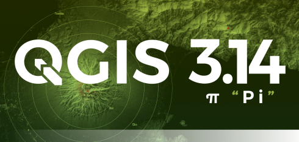

----

.. class:: chapter

   Awesomeness

.. image:: images/heart.png
    :class: centered
    :width: 200

-----

Services
========

+ Numerous services:
    + WMS 1.1.0 and WMS 1.3.0
    + WFS 1.1 and OGC API Features (aka WFS3)
    + WMTS
    + WCS

.. image:: images/wfs3.png
    :class: centered
    :width: 500

-----

Extensions of OGC standards
===========================

+ Vendor parameters and requests
+ Take full advantage of QGIS specificities
+ Some examples:

  + **GetFeature** and **EXP_FILTER**
  + **GetMap** and **HIGHLIGHT_GEOM**

.. image:: images/redlining.png
    :class: centered
    :width: 500

-----

Extensions of OGC standards II
==============================

+ The most famous: **GetPrint**

  + template selection
  + atlas

.. image:: images/getprint.jpg
    :class: centered
    :width: 600

-----

OGC certification
=================

+ QGIS 3.10 is certified for WMS 1.3.0
+ Ongoing certification for OGC API Features

.. image:: images/badge.png
    :class: centered
    :width: 200

-----

Configuration
=============

+ QGIS Desktop acts like a WYSIWYG

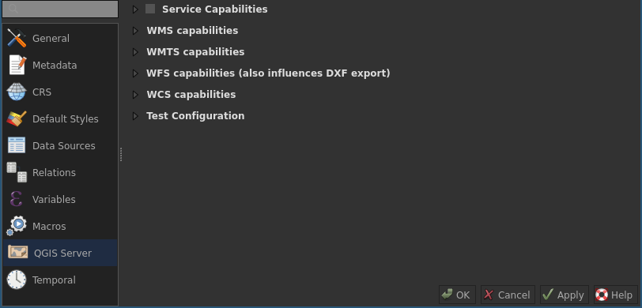

.. class:: centered

  **http://localhost/qgisserver?MAP=myproject.qgz**

-----

Programmability
===============

+ Python plugins

  + Filtering
  + Custom services (à la WMS)
  + Custom API (à la OGCAPIF)

+ Hello world plugin: https://github.com/elpaso/qgis-helloserver

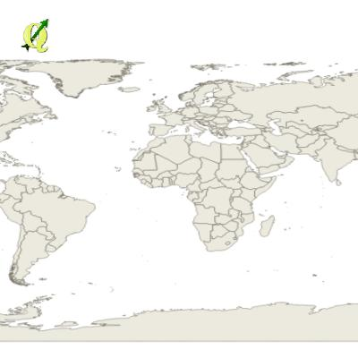

-----

Robustness
==========

+ Numerous unit tests
+ Continuous integration
+ Nightly OGC tests for WMS 1.3.0 and OGCAPIF on master

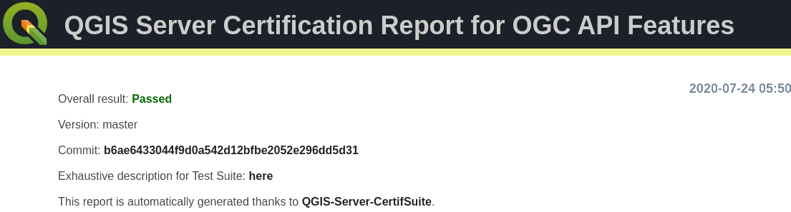

.. class:: centered

   http://test.qgis.org/ogc_cite/

-----

Docker images
=============

+ OpenQuake (my favorite): https://hub.docker.com/r/openquake/qgis-server
+ Kartoza: https://registry.hub.docker.com/u/kartoza/qgis-server
+ C2C: https://hub.docker.com/r/camptocamp/qgis-server
+ Oslandia: https://gitlab.com/Oslandia/qgis/docker-qgis
+ and a lot more

-----

Web clients
===========

+ Simple integrated web client for WFS3
+ `Lizmap <https://www.3liz.com/en/lizmap.html>`_
+ `QWC2 <https://blog.sourcepole.ch/assets/2019/qwc2-foss4g19.pdf>`_
+ `G3W Suite <https://g3wsuite.it/en/g3w-suite-publish-qgis-projects/>`_

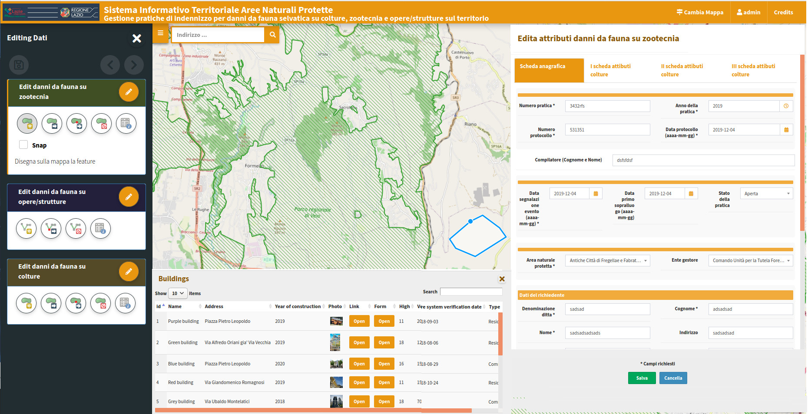

-----

Resources
=========

+ `Documentation: QGIS as OGC Data Server <https://docs.qgis.org/3.10/en/docs/user_manual/working_with_ogc/server/index.html>`_
+ `Cookbook: QGIS Server and Python <https://docs.qgis.org/testing/en/docs/pyqgis_developer_cookbook/server.html>`_
+ `PyQGIS: QGIS ServerAPI <https://qgis.org/pyqgis/3.10/server/index.html>`_
+ `Workshop: QGIS Server With Python Superpowers <http://itopen.it/bulk/FOSS4G-IT-2020>`_

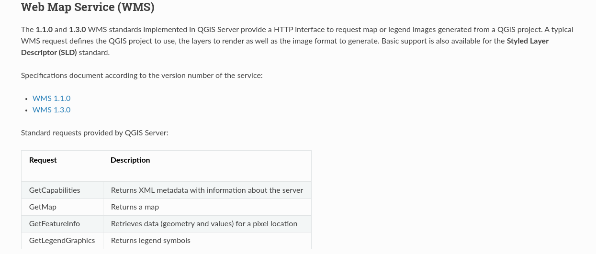

-----

Community
=========

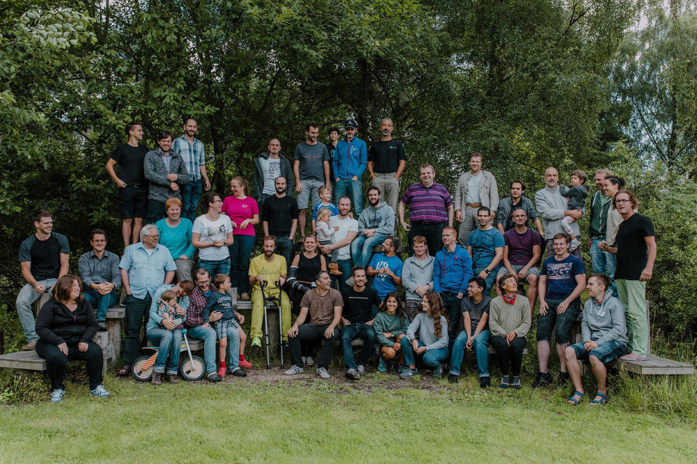

-----

.. class:: chapter

   Drawbacks

-----

Visibility
==========

+ No official logo
+ Buried documentation

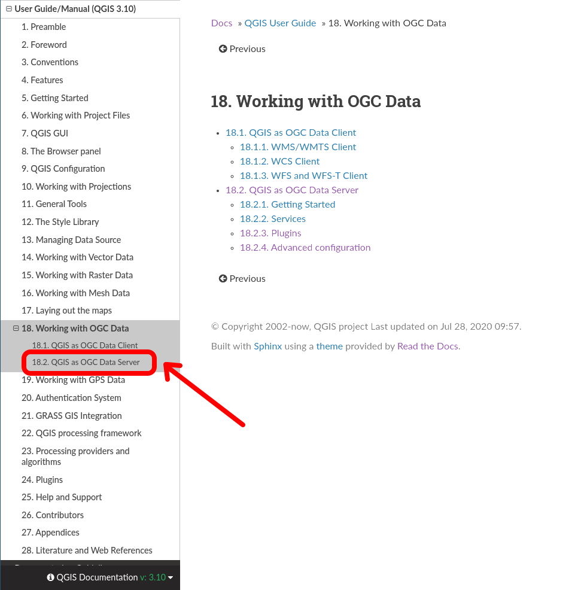

----

Performances
============

+ Same rendering engine
+ Not all QGIS Desktop features are server friendly

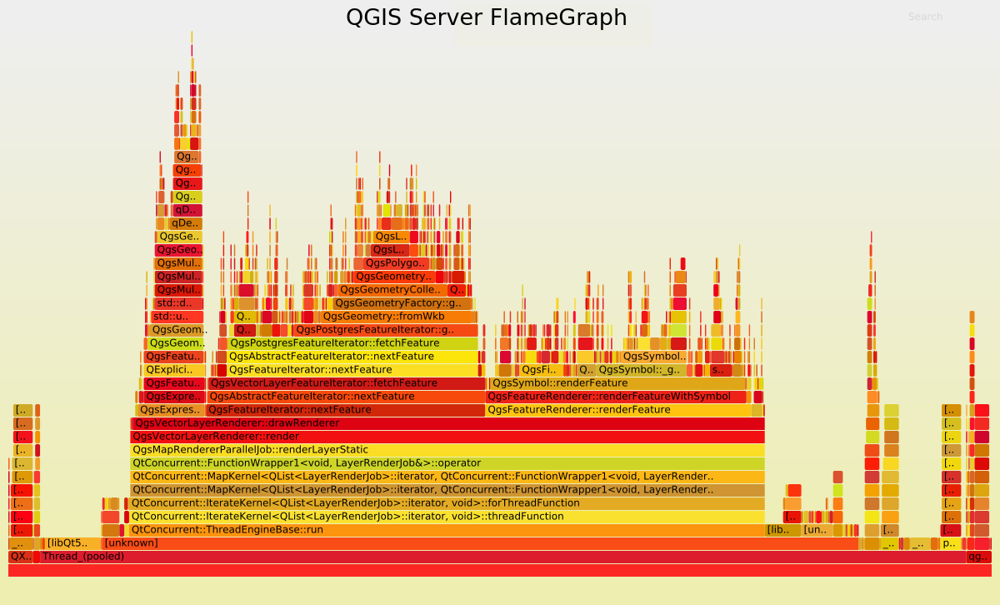

.. class:: centered

   `QGIS 3 and performance analysis <https://oslandia.com/2019/06/21/qgis-3-and-performance-analysis/>`_

----

Ecosystem
=========

+ QGIS Desktop plugins: ~1250
+ QGIS Server plugins: 11

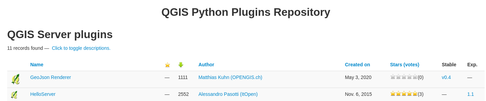

.. class:: centered

  https://plugins.qgis.org/plugins/server/

----

Out-of-the box experience
=========================

+ No administration panel
+ No monitoring panel
+ No landing page (except for OGCAPIF)
+ Not so sexy exception page

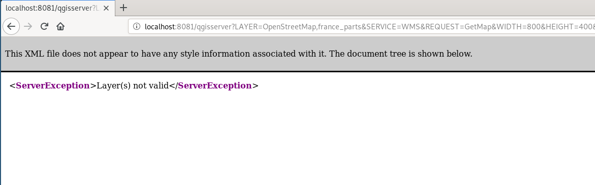

----

.. class:: chapter

   WIP

-----

Documentation
=============

+ A `QEP <https://github.com/qgis/QGIS-Enhancement-Proposals/issues/184>`_ has been funded by QGIS.org to:

  + Improve the documentation
  + Add a dedicated page for QGIS Server

-----

Performances
============

+ Monitoring to avoid regressions
+ `Another QEP <https://github.com/qgis/QGIS-Enhancement-Proposals/issues/185>`_ has been funded by QGIS.org

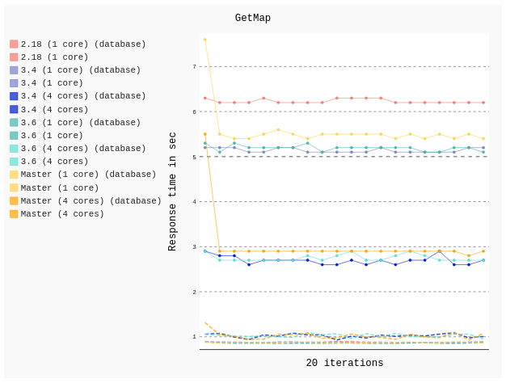

.. class:: centered

   http://test.qgis.org/perf_test/graffiti/

-----

Monitoring
==========

+ Big infrastructure
+ Currently under discussion
+ On the fly configuration?

-----

Catalog plugin
==============

+ Currently under development

.. image:: images/catalog.gif
    :class: centered
    :width: 800

-----

.. class:: chapter

   Thanks!

